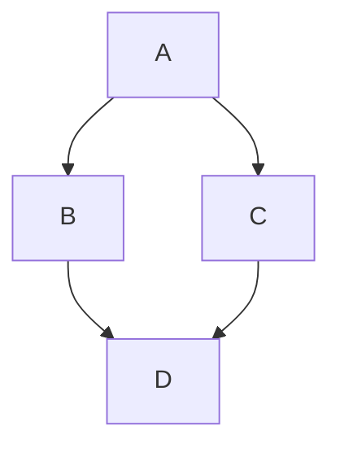

# Passport Photo Builder (Browser-only)

A simple, privacy-friendly passport photo maker that runs entirely in the browser.

If it's useful to you, a ⭐ on the repo helps other people find it.

What it does:
- Upload an image (no server upload)
- Pick your country from 50+ presets — each sets both the print size and the head height
  that country requires — or enter a custom size + DPI
- Crop with manual controls + automatic head framing
- Optional Auto Enhance (brightness/contrast/saturation baseline)
- Background removal (multiclass selfie segmentation, hair-aware) + choose background color
- Download:
  - Single photo (PNG / JPEG)
  - Print sheet (A4 / A3 / 4x6 / Custom) with auto-pack + cut lines

Deployed example (your Vercel URL):
- Add your URL here

https://passport-maker-ten.vercel.app/

---

## Tech Stack

- React + TypeScript
- Vite
- Zustand (state management)
- react-easy-crop (crop UI)
- MediaPipe Tasks Vision (face detection + multiclass selfie segmentation)


Everything is client-side.


---

## Features

### Step 1: Upload + Size
- 50+ countries and documents, searchable and grouped by region (`utils/presets.ts`)
- Each preset carries two things, not one:
  - the **print size** (35×45mm across most of the world, 2×2in in the US, 50×70mm in
    Canada, 33×48mm in China, 26×32mm in Spain)
  - the **head height** the authority asks for, as a fraction of the photo. This is the part
    most tools skip: Canada wants the face to fill under half the frame, Australia and Japan
    want about three quarters. Cropping every country to the same proportions gives you a
    photo that is the right size and still gets rejected.
- Where a country publishes no chin-to-crown figure, a neutral ICAO proportion is used and
  the UI says so rather than inventing a number
- Custom size: width / height, units (mm, cm, inch, px), DPI
- Size, preset and DPI live in the URL, so a setup can be bookmarked or shared

### Step 2: Crop
- Manual crop (pan/zoom/rotate)
- Auto-frame head — runs automatically when a photo is loaded:
  - the crown is measured from the segmentation mask (which includes hair), not guessed from
    the face box, so tall or voluminous hair isn't cropped off
  - the chin comes from the face detector, and the frame is laid out to passport proportions:
    head ≈ 62% of the photo height with ~10% clear above the crown
- Auto Enhance:
  - estimates good brightness/contrast/saturation defaults


### Step 3: Background
- Keep original vs background removed
- Background color picker
- Soften edge (extra blur on the finished edge; usually not needed)
- Trim edge (pulls the cut-out edge in to kill a colour fringe; raising it thins fine hair)

The segmentation model only seeds the cut-out. Its mask is far too coarse for hair — it
returns a smooth blob, and it drops accessories such as hair ribbons entirely. So the edge is
re-derived from the photo at full resolution (`utils/matting.ts`):

- the mask's boundary is widened *outward* into the background, into a band where stray hair
  might live; regions the model is confident about are never re-estimated, so ribbons and
  collars can't be washed out
- inside that band the local foreground and background colours are estimated, and the
  compositing equation `I = aF + (1-a)B` is solved per pixel for the alpha
- two confidence terms keep a wide band safe: how distinguishable F and B are, and how well
  the solved alpha actually explains the pixel (a wrinkle in the backdrop does not)
- where that colour model can't explain a pixel, distance from the local backdrop colour
  decides instead — this is what rescues a blue ribbon the model called background
- a guided filter follows image edges rather than mask edges, and the old background colour
  is finally unmixed out of the semi-transparent pixels so pale hair keeps no rim of the
  room it was shot in

### Step 4: Download
- Single image export (PNG/JPEG)
- Print sheet export (PNG/JPEG):
  - A4, A3, 4x6 inch, Custom
  - auto-pack with user-requested count
  - cut lines + outer crop marks


---

## Privacy

This tool is **browser-only**:
- Images never leave your device.
- No backend and no storage.
- Models are downloaded by the browser at runtime (MediaPipe model assets).

If you want “offline / self-hosted models” later, see the notes in the “MediaPipe models” section below.


---

## Setup

### Prerequisites
- Node.js 18+ (recommended)
- npm (or pnpm/yarn)

### Install
```bash
npm install
```

